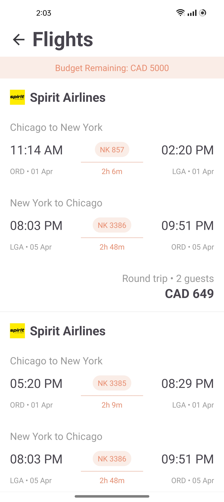
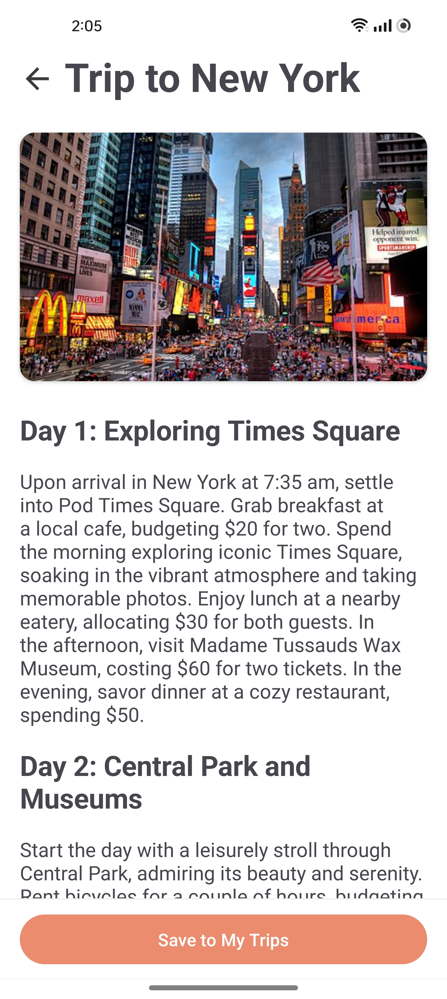

# SingleStep - AI Powered Travel Planner

## :busts_in_silhouette: Group Members (Group #20)

This project was developed as part of the *SE2: Software Design and Architecture - CS 446, CS 646, ECE 452* course offered at the University of Waterloo. This is not an individual project, but rather a group effort. Each member has contributed to various aspects of the project development.

|Name | User ID | Student Number |
|:------|:---------|:--------------|
|Arjun Mehta|a47mehta|20839709|
|Justin Lu|j352lu|20829900|
|Yichun Shen|y275shen|20776079|
|Chris Tan|c46tan|20826300|
|Vincent Thao Wong|vt2wong|20791088|
|Andy Yu|z274yu|20835121|

## :memo: Overview

SingleStep is an AI powered trip-planning app that leverages OPEN AI's GPT3.5-Turbo model to craft personalized day-by-day trip itineraries. It also allows users to seamlessly search for flights, hotels, and nearby tourist attractions.

<p float="left">
  
  
  
  
  
  
  
  
  
  
</p>

## :books: Libraries Used
- [Glide](https://github.com/bumptech/glide) - Used for loading and caching images for destinations, hotels etc.
- [Retrofit](https://square.github.io/retrofit/) - Used for making API GET requests to fetch hotels and itinerary response
- [RoomDB](https://developer.android.com/training/data-storage/room) - Used for storing saved trip itineraries for offline viewing
- [Amadeus Android SDK](https://github.com/amadeus4dev-examples/amadeus-android) - Used to fetch airports, flights and local tourist attractions
- [Google Places SDK](https://developers.google.com/maps/documentation/places/android-sdk/overview) - Used to fetch city data and autocomplete city names
- [Facebook Shimmer](https://github.com/facebookarchive/shimmer-android) - Used for loading animations throughout the application
- [Jsoup](https://jsoup.org/) - Used to parse HTML description for tourist attractions into text

## :artificial_satellite: APIs Used
- [Amadeus API](https://developers.amadeus.com/) - Used the following endpoints for multiple features:
  -  `shopping/activities` - Used to fetch local tourist attractions
  -  `shopping/flightOffersSearch` - Used to fetch flights for given input trip parameters
  -  `referenceData/locations/airports` - Used to fetch airport IATA codes for given set of coordinates

- [Booking.COM Scraper API](https://rapidapi.com/ntd119/api/booking-com18) - Used the `stays/search-by-geo` endpoint to fetch hotels for given input trip parameters

- [Google Places API](https://developers.google.com/maps/documentation/places/web-service/overview) - Used for autocompleting source and destination city name on the Search page

- [OpenAI API GPT3.5 Model](https://platform.openai.com/docs/models/gpt-3-5-turbo) - Used for generating day-by-day intinerary for given input trip parameters, selected hotel and flights

## :runner: How To Run
To run the backend server, simply attach your OPEN AI API Key in the `backend/prompt/inference.py` file and run the following command:
```
python3 .\backend\app.py
```

Then, ensure that your API keys for Google Places API, Amadeus API, and Booking.com API are configured correctly inside the `app/res/values/strings.xml` file.
```
<string name="places_api_key">YOUR_API_KEY_HERE</string>
<string name="amadeus_api_key">YOUR_API_KEY_HERE</string>
<string name="amadeus_api_secret">YOUR_API_SECRET_HERE</string>
<string name="booking_api_key">YOUR_API_KEY_HERE</string>
<string name="booking_api_host">booking-com18.p.rapidapi.com</string>
```


